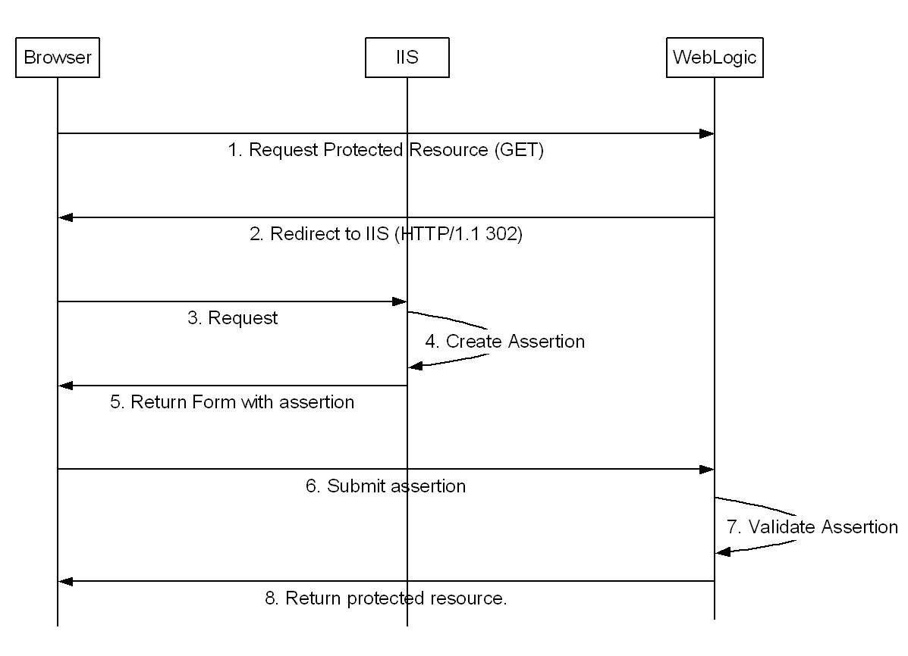
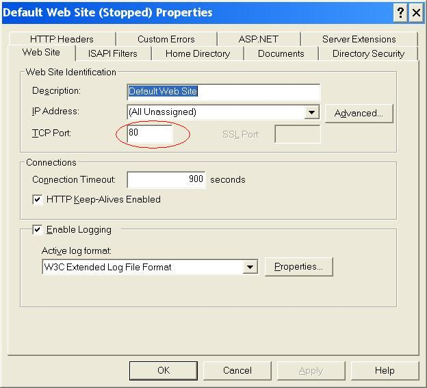
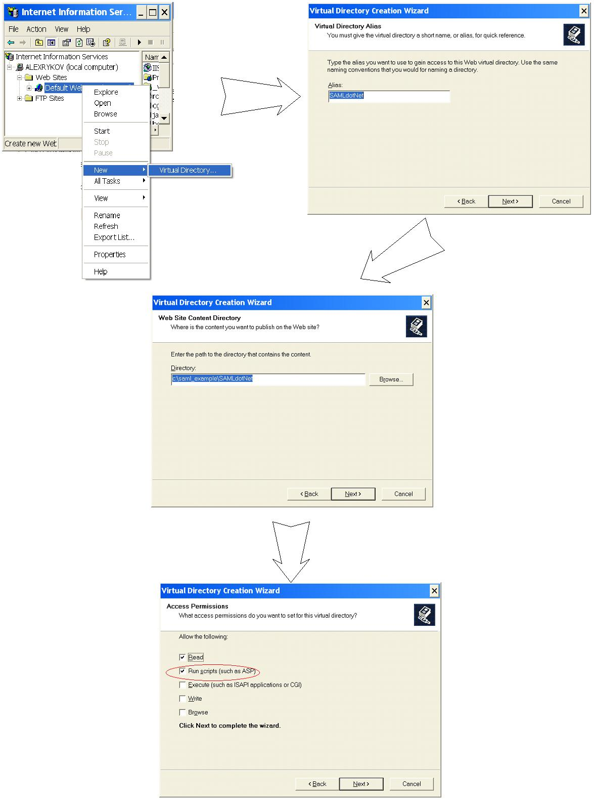

Archive of old dev2dev article. 

<h2> Single Sign On between WebLogic Server 9.2 and IIS using SAML</h2>

by Alex Rykov

01/23/2007
<h3>Abstract</h3>

Implementing Single Sign On (SSO)
for several sites is a problem that has a multitude of variations and
quite a
few solutions.&nbsp; Security Assertion Markup Language (SAML) has
emerged in the
last five years to address this problem in a standard way and WebLogic
Server 9
offers extensive support for it. Unfortunately, simple SAML
configuration
examples, especially for cross platform scenarios are hard to come by.

This article describes a simple
SAML SSO scenario between Internet Information Services Server and
WebLogic
Server 9. This article assumes some knowledge of SAML. It is
accompanied by a
fully functional example that includes ASP.NET code as well as a script
to
fully configure WebLogic Server.

 

<h3>Introduction</h3>

Recently I did some work for a customer who decided to add WebLogic
Portal 9 into a predominantly ASP.NET Web infrastructure. The old and
new sites had to coexist as seamlessly as possible and Single Sign On
was a must. 

In the past that would have meant a lot of work &ndash; probably,
writing another clunky security provider. Luckily, WebLogic Server 9
offers SAML support out of the box.

SAML is an XML-based standard for communicating user authentication,
entitlement, and attribute information. Harold Lockhart in his article <a href="https://web.archive.org/web/20080411011356/http://dev2dev.bea.com/pub/a/2005/11/saml.html">Demystifying
SAML</a> and Beth Linker in her <a href="https://web.archive.org/web/20080411002406/http://dev2dev.bea.com/pub/a/2006/08/introduction-saml.html">Introduction
to SAML</a> provide a good introduction to this technology.

Unlike WebLogic Server 9, IIS does not provide SAML support
out of the box. For simple scenarios handcrafting SAML assertions is
fairly
easy and that is what I have done. In more complicated cases try using
Web
Services Enhancements (WSE).

<h3>Solution</h3>

My customer had a solidly
functioning IIS authentication solution which I decided to reuse. The
.Net side
was going to maintain responsibility for authentication and to produce
SAML
assertions for WebLogic Server to consume. The network setup made
direct
communication between the two servers impossible, leaving the POST SAML
profile
as the only option.

 

<i>Figure 1: SAML Protected Resource Access Sequence</i>

Figure 1 depicts the POST SAML profile applied to my scenario. In SAML
terminology WebLogic Server is a resource provider and IIS - identity
assertion provider.

We have a protected WebLogic Server application that a
browser is attempting to access. Only the user <i>weblogic</i>
is allowed to
view this resource, <a href="http://localhost:7001/protected/secret.jsp">http://localhost:7001/protected/secret.jsp</a>
. When accessed, we want IIS to expose a page that validates the user's
identity and creates SAML assertions at <a href="http://localhost/SAMLdotNet/Login.aspx">http://localhost/SAMLdotNet/Login.aspx</a>.

With this in mind, let's look at the
typical security flow
described in Figure 1:

<ol>
<li>The browser sends a GET /protected/secret.jsp to WebLogic Server</li>

<li>WebLogic Server responds with HTTP/1.1
302 Moved Temporarily and redirects the browser to&nbsp; <a href="http://localhost/SAMLdotNet/Login.aspx?RPID=rp_00001&amp;APID=ap_00001&amp;TARGET=http://localhost:7001/protected/secret.jsp">http://localhost/SAMLdotNet/Login.aspx?RPID=rp_00001&amp;APID=ap_00001&amp;TARGET=http://localhost:7001/protected/secret.jsp</a>
 

The resource provider ID (RPID) identifies protected resource provider.
It is used by assertion provider to distinguish between potentially
multiple resource providers it generates assertions for.&nbsp; This
ID allows IIS to return control to WLS which requested assertion and
not another system. 

The assertion party ID (APID) identifies assertion party the same way
RPID identifies resource provider. WebLogic Server needs to know which
assertion party created a particular assertion to properly validate it. 
</li>
<li>The browser sends a GET
/SAMLdotNet/Login.aspx?RPID=rp_00001&amp;APID=ap_00001&amp;TARGET=http://localhost:7001/protected/secret.jsp
to IIS </li>

<li>Login.aspx validates the
user&rsquo;s identity and generates a SAML assertion</li>

<li>A form containing this newly generated
assertion is returned to the browser.</li>

<li>The form received from IIS is posted
to WebLogic Server at <a href="http://localhost:7001/samlacs/acs">http://localhost:7001/samlacs/acs</a>.
The server is configured to perform SAML Identity assertions at this
URL. </li>

<li>WebLogic Server validates the
assertion and forwards the request to /protected/secret.jsp if
successful. </li>

<li> The result is returned to the browser.</li>
</ol>

The rest of this article describes how this was
accomplished.

<h3>Protecting a Web Application</h3>

The first step on the way to using
SAML assertions is securing the <i>protected</i> web
application. This sample
web application is included in the example. There is nothing new here -
the
&lt;security-constraint&gt; XML tag and its association with a
security role are
configured in web.xml. The weblogic.xml configuration file defines how
roles
map to principals. 

Protecting the application here simply means applying
standard Java EE security constraints. 

<h3>Key Pair</h3>

In order to establish trust between
WLS and IIS you have to generate an asymmetric key pair and load these
keys
into the WebLogic Server and Windows keystores. For your convenience
there is a
pair of keys attached to this article: saml_dsa.pfx contains a private
key and
saml_dsa.cer contains its matching certificate.

<a name="privatekey">You have to do two things to allow
your ASP.NET application to use the private key:</a>

<ol>
<li>The private key has to be loaded into Windows key store.</li>
 
To do this, perform the following steps:
 
<ol type='a'>
<li>Double click on LocalMachineKeyStore.msc</li>
<li>In the tree on your left expand Certificates\Personal\Certificates</li>
<li>Right click on Certificates and in All tasks select Import</li>
<li>Click on Next</li>
<li>Change file type to &quot;Personal Information Exchange&quot; and select saml_dsa.pfx</li>
<li>Click on Next</li>
<li>Don't enter any password and click next</li>
<li>Click on Finish</li>
</ol>

User "ASPNET", that owns ASP.NET process under IIS has to be granted privileges to access the private key. This can be done using the following command:winhttpcertcfg -g -c LOCAL_MACHINE\My -s "saml_dsa" -a ASPNET. This utility can be downloaded here:
<a href="http://www.microsoft.com/downloads/details.aspx?familyid=C42E27AC-3409-40E9-8667-C748E422833F&amp;displaylang=en">http://www.microsoft.com/downloads/details.aspx?familyid=C42E27AC-3409-40E9-8667-C748E422833F&amp;displaylang=en</a>

<li>Client certificate has to be loaded into WLS. This is done automatically by WLST script setup_script.py. Postpone running this script until the next section.</li>

This key pair will be used to
verify authenticity of assertions. IIS will sign produced assertions
using the
private key. WLS will use the certificate to validate signature of IIS.

</ol>
<h3>Configuring WebLogic Server</h3>

All steps required to configure
WebLogic Server to use SAML for the purposes of this example are automated by
the included WLST script: <i>setup_script.py</i>. Before going further, run <i>wlst
setup_script.py</i>. This will create a SAML enabled WebLogic Server domain.
Start the resulting administration server and go to the console to observe how
it is configured. No manual configuration steps are required.

To enable SAML this script configures two major components: <i>SAML Identity Asserter</i> and <i>SAML Destination Site</i>

<h4>SAML Identity Asserter</h4>

The SAML Identity Asserter can be
found in the administration console under <i>Security Realms\myrealm\Providers.</i>It is an authentication provider of type SAMLIdentityAsserterV2. All of its important
properties are located under the <i>Management</i> tab, which has two sub tabs: <i>Certificates</i> and <i>Assertion Parties</i>

The signature verification certificate is loaded under the <i>Certificates</i> tab. 

The <i>Assertion Parties </i>tab is
used to configure the assertion parties. In this example only one item was
configured. It corresponds to IIS, the only partner of this site. Note the
following properties of the assertion party:

The <i>POST Signing Certificate
Alias</i> property is used during SAML Response signature validation. It
references the certificate loaded through the <i>Certificates</i> tab. Without
it there is no way to tell whether a message delivered from the partner has
been tampered with.

The <i>Source Site Redirect URIs</i>
property defines a list of URIs that trigger the SAML assertion sequence when
someone tries to access them (Diagram 1, Step 2).

The <i>Source Site ITS URL</i>
property defines the URL that has to be called on the partner’s side. The
request to this URL will contain the TARGET parameter and additional parameters
defined in the <i>Source Site ITS Parameters</i> property. The TARGET parameter
specifies the URI  that the user is trying to access(/protected/secret.jsp in
this example)

The <i>Source Site ITS Parameters</i>
property identifies additional parameters that are passed during the call to
the <i>Source Site ITS URL</i>. In this case RPID=rp_00001 and APID=ap_00001
are specified.

RPID is used to indicate the party
that initiated the assertion sequence. IIS uses this parameter to figure out
what URL to use for callback in step 6 of the assertion sequence (Diagram 1).
APID contains the assertion party ID that WLS knows IIS by. This parameter has
to be sent to WLS for assertion to succeed.

<i>Issuer URI</i> property is one
of the components used to validate an assertion. It has to match the Issuer URI
in the assertion XML.

Generally all users that are trying
to get access to protected resource not only have to have a valid assertion but
they also have to “be known” to WebLogic. At least one of the Authenticators
has to be able to authenticate the user. Enabling <i>Allow Virtual Users</i>
property allows users “unknown” to WebLogic to still get access to protected
resources provided a valid assertion. This feature works in tandem with <i>SAML
Authenticator</i> that has to be created for this to work. There are no
configuration parameters for it.

<h4>SAML Destination Site</h4>

To make sure that there is a
servlet waiting for SAML Responses, a <i>SAML Destination Site</i> had to be
configured. This configuration can be observed through the WLS console under <i>Environment/Servers/&lt;Server
Name&gt;/Federation Services/SAML 1.1 Destination Site</i>.

The <i>Assertion Consumer URIs</i>
property tells WLS which URIs to listen on for SAML Responses. In this example,
the default:  /samlacs/acs is used. A browser will post an assertion form to this
URI (Figure 1, Step 6)

The <i>ACS requires SSL</i>
property can be enabled to avoid the risk of SAML assertion interceptions. In
this example it is turned off for simplicity. If you want to turn it on you
need to configure WebLogic Server to listen on the SSL port and make sure IIS
performs call backs using HTTPS, rather than HTTP.

This was not too hard was it? I did not have to modify the
application at all to support SAML. All required work was done by WebLogic
Server configuration changes. If you wanted to slap SAML on top of your
existing systems you could do it without touching deployed applications.

<h3>Creating assertions in .Net</h3>

For the purposes of this example two .Net components were
created. 

Login.aspx receives assertion
requests and generates forms with assertions created in response to those
requests. SAMLAssertionCreator.cs encapsulates the assertion creation logic.

Example 1 shows a real SAML
response generated by this ASP.NET application. It contains one assertion with
an authentication statement.  This assertion states that it has been issued on
Nov 16, 2006 at 8:57 AM by <a href="https://aspsite.com/">https://aspsite.com</a>
and is valid between 8:57AM and 8:58AM. It confirms that the user <i>weblogic</i>
was authenticated using password authentication.

<pre class="code">
&lt;samlp:Response 
   xmlns:samlp="urn:oasis:names:tc:SAML:1.0:protocol"
   MajorVersion="1" MinorVersion="1" 
   ResponseID="b8049e0c9e99f6a270ac05ad70f7384d" 
   IssueInstant="2006-11-16T18:57:59.59Z" 
   Recipient="http://localhost:7001/samlacs/acs"&gt;
  &lt;samlp:Status&gt;
    &lt;samlp:StatusCode Value="samlp:Success"/&gt;
  &lt;/samlp:Status&gt;
  &lt;saml:Assertion 
     xmlns:saml="urn:oasis:names:tc:SAML:1.0:assertion" 
     AssertionID="ccde3775286167a3bd1c9f5dec4f153a" 
     IssueInstant="2006-11-16T18:57:59.59Z" 
     Issuer="https://aspsite.com" 
     MajorVersion="1" MinorVersion="1"&gt;
    &lt;saml:Conditions 
      NotBefore="2006-11-16T18:57:59.59Z" 
      NotOnOrAfter="2006-11-16T18:58:59.59Z"/&gt;
      &lt;saml:AuthenticationStatement 
        AuthenticationInstant="2006-11-16T18:57:59.59Z" 
        AuthenticationMethod=
         "urn:oasis:names:tc:SAML:1.0:am:password"&gt;
        &lt;saml:Subject&gt;
          &lt;saml:NameIdentifier&gt;weblogic&lt;/saml:NameIdentifier&gt;
          &lt;saml:SubjectConfirmation&gt;
            &lt;saml:ConfirmationMethod&gt;
                urn:oasis:names:tc:SAML:1.0:cm:bearer
            &lt;/saml:ConfirmationMethod&gt;
          &lt;/saml:SubjectConfirmation&gt;
        &lt;/saml:Subject&gt;
      &lt;/saml:AuthenticationStatement&gt;
   &lt;/saml:Assertion&gt;
&lt;/samlp:Response&gt;
</pre>
<i>Example 1: SAML Response. </i>

While I don't intend to provide
detailed explanation of SAML message structure, two key points need to be
highlighted:

<ul>
<li>It is not a coincidence that the SAML assertion issuer matches
the Issuer URI specified in WebLogic Server assertion party configuration. If
they did not match assertion validation would fail.</li>

<li>The NotBefore and especially NotOnOrAfter assertion conditions
are extremely important. They effectively specify an expiry date thus limiting
the use of intercepted assertions. If IIS and WLS are running on separate
physical machines it is important to make sure time their times are
synchronized  and that time zones are set correctly. </li>
</ul>

Once the assertion is created it
has to be put into a form and returned to the client. There are three fields
that get populated(Example 2):

<ol>
<li>The TARGET field in this form contains the URI of the protected
resource. It is received by IIS as part of the redirect from WebLogic. </li>

<li>
The SAMLResponse field contains a base64 encoded SAML Response.</li>

<li>
The APID field contains the assertion party identifier associated with
IIS. </li>
</ol>

The form gets automatically
submitted to the WebLogic Server URL(stored in redirectURL in this example),
configured in the WebLogic Federation Service tab. In this case it is <a
href="http://localhost:7001/samlacs/acs">http://localhost:7001/samlacs/acs</a>. 

<pre class="code">
&lt;%
saml.SAMLAssertionCreator assertionCreator = new saml.SAMLAssertionCreator();
/*
 * For purposes of this example no authentication is performed at any level.
 * In real scenario this HAS TO BE FIXED. 
 * 
 */

String assertionResponse = 
      assertionCreator.createAssertion("weblogic",
                                       "https://oldsite.com", 
                                       redirectURL, 
                                       "saml_dsa");
String base64 =Convert.ToBase64String(
                       Encoding.UTF8.GetBytes(assertionResponse))
%&gt;      
      &lt;form name="GoToWLS" 
            action="&lt;%=redirectURL%&gt;" 
            method="post"&gt;
        &lt;input type="hidden" name="TARGET" 
               value="&lt;%=target%&gt;" /&gt;
        &lt;input type="hidden" name="SAMLResponse" 
               value="&lt;%=base64%&gt;"/&gt;
        &lt;input type="hidden" name="APID" 
               value="&lt;%=apid%&gt;" /&gt;
        &gt;                        
    &lt;/form&gt;
    &lt;SCRIPT language="JavaScript"&gt;
      document.GoToWLS.submit()
    &lt;/SCRIPT&gt;

</pre>
<i>Example 2: ASP.Net Code to Generate Asserting Form</i>

<h3>Configuring Internet Information
Services</h3>

To configure IIS server, use Administrative Tools in your
Windows Control Panel. Assuming that IIS has already been installed and <a href="#privatekey">private key imported and ready for use</a>, you only need to
perform the following three steps.

<ol>

<li> Make sure that IIS runs on port 80 as shown in figure 2.</li>

<i>Figure 2: IIS Web Site Configuration</i>

<li>Configure SAMLdotNet Virtual Directory to point to to the
location of SAMLdotNet application as shown in Figure 3. </li>

 
<i>Figure 3: Virtual Directory Configuration Steps</i>

</ol>

<h3>Trying it out.</h3>

Assuming your WebLogic Server is running locally on port 7001, go to <a
href="http://localhost:7001/protected/secret.jsp">http://localhost:7001/protected/secret.jsp</a>. You will see your principal name
which should be weblogic. For the purposes of this example, your credentials do
not get validated. ASP just creates an assertion for the user weblogic, signs
it and passes it back. Obviously, this is not sufficient for secure
environments.

<h3>Download</h3>
<ul>
<li><a href="saml_example">Sample code and configuration for this tutorial</a></li>
</ul>

<h3>Summary</h3>

WebLogic Server 9 makes Single Sign
On implementation fairly simple. Once you are comfortable configuring a SAML
security provider, the thought of creating a custom security solution when SAML
is an option will never cross your mind. SAML provides a standard and extensible way of implementing
single sign on. This makes it a perfect fit for deploying cross platform solutions. 

<h3>References</h3>

<ul>
<li><a href="https://web.archive.org/web/20080415004931/http://dev2dev.bea.com/pub/a/2006/12/sso-with-saml.html">Configuring
Single Sign-On using SAML in WebLogic Server 9.2</a> by Vikrant Sawant
(Dev2Dev, 2007)</li>

<li><a
href="https://web.archive.org/web/20080411002406/http://dev2dev.bea.com/pub/a/2006/08/introduction-saml.html">Introduction
to SAML</a> by Beth Linker (Dev2Dev, 2006)</li>

<li><a href="https://web.archive.org/web/20080411011356/http://dev2dev.bea.com/pub/a/2005/11/saml.html">Demystifying
SAML</a> by Harold Lockhart (Dev2Dev, 2005)</li>

<li><a href="https://web.archive.org/web/20090425162523/http://e-docs.bea.com/wls/docs92/secmanage/saml.html">Configuring
Single Sign-On with Web Browsers and HTTP Clients</a> - product documentation,
WebLogic Server</li>
</ul>

